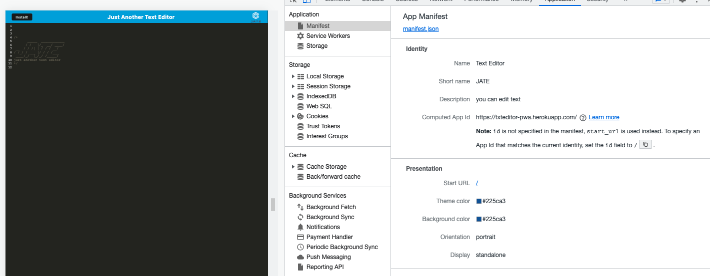

# TEXT EDITOR PWA

  ### 

## Description

Text editor is an app that meets the PWA criteria and can work supported by the browser. Aditionally, the application can function offline caching data and implement methods for getting and storing data to an IndexedDB database using the idb package which is a lightweight wrapper around the IndexedDB API.

This app can be installed as a Progressive Web Application by clicking in the install button.

This app has been built with the follwoing technologies:
* 
* 
* 
* 
* 

## Table of Contents

  - [Installation](#installation)
  - [Usage](#usage)
  - [Mock-Up](#mock-up)
  - [License](#license)
  - [Contribution](#contribution)
  - [Tests](#tests)
  - [Questions](#questions)

## Installation

The Package json is already added in this project, so you should only have to install it in your terminal typing the following 'npm i'.

## Usage

To run the application in your local host, you should type in your terminal the following  `npm run start:dev` and then going to your browser at `http://localhost:3000/`. You will be able to see the app running in the browser.

## Mock-Up

Text editor App installed:

You can see a `manifest.json` file:

You can see the application's registered service worker:

You can see the IndexedDB storage:

## License

### MIT License (https://opensource.org/licenses/MIT)

      MIT License Copyright (c) [year] [fullname]
      
      Permission is hereby granted, free of charge, to any person obtaining a copy
      of this software and associated documentation files (the "Software"), to deal
      in the Software without restriction, including without limitation the rights
      to use, copy, modify, merge, publish, distribute, sublicense, and/or sell
      copies of the Software, and to permit persons to whom the Software is
      furnished to do so, subject to the following conditions:
      
      The above copyright notice and this permission notice shall be included in all
      copies or substantial portions of the Software.
      
      THE SOFTWARE IS PROVIDED "AS IS", WITHOUT WARRANTY OF ANY KIND, EXPRESS OR
      IMPLIED, INCLUDING BUT NOT LIMITED TO THE WARRANTIES OF MERCHANTABILITY,
      FITNESS FOR A PARTICULAR PURPOSE AND NONINFRINGEMENT. IN NO EVENT SHALL THE
      AUTHORS OR COPYRIGHT HOLDERS BE LIABLE FOR ANY CLAIM, DAMAGES OR OTHER
      LIABILITY, WHETHER IN AN ACTION OF CONTRACT, TORT OR OTHERWISE, ARISING FROM,
      OUT OF OR IN CONNECTION WITH THE SOFTWARE OR THE USE OR OTHER DEALINGS IN THE
      SOFTWARE.

## Contribution

Jorge Cardenas

## Tests

No tests.

## Questions

My GitHub: https://github.com/Jorgecdl96

You can send an e-mail to Jorgecdl96@gmail.com for any additional question.

## Application Deployed

You can see this app deployed in Heroku at link below:

https://txteditor-pwa.herokuapp.com/

